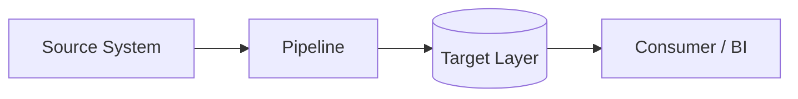
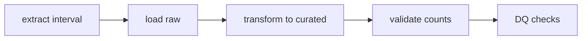

# Design note: <pipeline name>

**Client**: <client>
**Author**: <name>
**Date**: <YYYY-MM-DD>
**Status**: Draft | Under review | **Approved (gate for implementation)** | As-built

## 1. Business objective

<What decision or process this enables. Not "a table with X" — why X matters.>

## 2. Source to target

| | Detail |
| --- | --- |
| Source system | <system, table/endpoint/topic> |
| Ingestion pattern | full refresh / incremental / streaming |
| Target layer | raw / curated / serving |
| Target table(s) | <schema.table> |
| Grain | One row per <X> |
| History strategy | current-state / append-only / SCD1 / SCD2 / snapshots |
| Load pattern | <bounded replace / delete+insert / upsert> on <key> |
| Schedule | <cadence + timezone> |

## 3. Architecture

### Context view

### Flow view

## 4. Transformation logic

<Key rules, joins, business definitions. Which time drives the incremental filter
(event / processing / partition) and how late data is handled.>

## 5. Trade-offs

| Option | Pros | Cons | Decision |
| --- | --- | --- | --- |
| <chosen> | | | chosen because <reason> |
| <rejected alternative> | | | rejected because <reason> |

## 6. Success criteria (verifiable)

- [ ] <e.g. Row count for the loaded interval matches source within 0.1%>
- [ ] <e.g. Re-running the same interval produces identical key totals>
- [ ] <e.g. Freshness check passes within SLA for 7 consecutive days>

## 7. Out of scope

- <Explicit exclusions — the scope fence>

## 8. Dependencies and downstream

- Upstream: <systems, teams, access needed>
- Downstream: <who consumes this, what breaks if it changes>

## 9. Open questions

| Question | Owner | Due |
| --- | --- | --- |

## 10. Approval

Approved by <name/role> on <date>, via <channel>.
